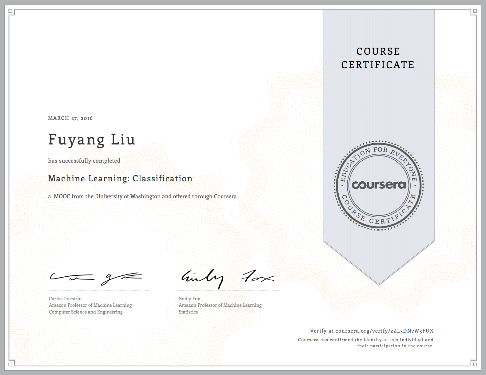

# Machine Learning - Coursera

## Course 3 - Classification

### About this course

In this course, you will create classifiers that provide state-of-the-art performance on a variety of tasks.  You will become familiar with  the most successful techniques, which are most widely used in practice, including logistic regression, decision trees and boosting.

In addition, you will be able to design and implement the underlying algorithms that can learn these models at scale, using stochastic gradient ascent.  You will implement these technique on real-world, large-scale machine learning tasks.  You will also address significant tasks you will face in real-world applications of ML, including handling missing data and measuring precision and recall to evaluate a classifier.

Learning Objectives: By the end of this course, you will be able to:
* Describe the input and output of a classification model.
* Tackle both binary and multiclass classification problems.
* Implement a logistic regression model for large-scale classification.  
* Create a non-linear model using decision trees.
* Improve the performance of any model using boosting.
* Scale your methods with stochastic gradient ascent.
* Describe the underlying decision boundaries.  
* Build a classification model to predict sentiment in a product review dataset.  
* Analyze financial data to predict loan defaults.
* Use techniques for handling missing data.
* Evaluate your models using precision-recall metrics.
* Implement these techniques in Python (or in the language of your choice, though Python is highly recommended).

### Certificate

### Syllabus

#### Week1 - Linear Classifiers & Logistic Regression
* Welcome to the course
* Course overview and details
* Linear classifiers
* Class probabilities
* Logistic regression
* Practical issues for classification
* Summarizing linear classifiers & logistic regression
* Programming Assignment

#### Week2 - Learning Linear Classifiers, Overfitting & Regularization in Logistic Regression
* Maximum likelihood estimation
* Gradient ascent algorithm for learning logistic regression classifier
* Choosing step size for gradient ascent/descent
* (VERY OPTIONAL LESSON) Deriving gradient of logistic regression
* Summarizing learning linear classifiers
* Programming Assignment
* Overfitting in classification
* Overconfident predictions due to overfitting
* L2 regularized logistic regression
* Sparse logistic regression
* Summarizing overfitting & regularization in logistic regression
* Programming Assignment

#### Week3 - Decision Trees
* Intuition behind decision trees
* Learning decision trees
* Using the learned decision tree
* Learning decision trees with continuous inputs
* Summarizing decision trees
* Programming Assignment 1
* Programming Assignment 2

#### Week4 - Preventing Overfitting in Decision Trees and Handling Missing Data
* Overfitting in decision trees
* Early stopping to avoid overfitting
* (OPTIONAL LESSON) Pruning decision trees
* Summarizing preventing overfitting in decision trees
* Programming Assignment
* Basic strategies for handling missing data
* Strategy 3: Modify learning algorithm to explicitly handle missing data
* Summarizing handling missing data

#### Week5 - Boosting
* The amazing idea of boosting a classifier
* AdaBoost
* Applying AdaBoost
* Programming Assignment 1
* Convergence and overfitting in boosting
* Summarizing boosting
* Programming Assignment 2

#### Week6 - Precision-Recall
* Why use precision & recall as quality metrics
* Precision & recall explained
* The precision-recall tradeoff
* Summarizing precision-recall
* Programming Assignment

#### Week7 - Scaling to Huge Datasets & Online Learning
* Scaling ML to huge datasets
* Scaling ML with stochastic gradient
* Understanding why stochastic gradient works
* Stochastic gradient: Practical tricks
* Online learning: Fitting models from streaming data
* Summarizing scaling to huge datasets & online learning
* Programming Assignment
